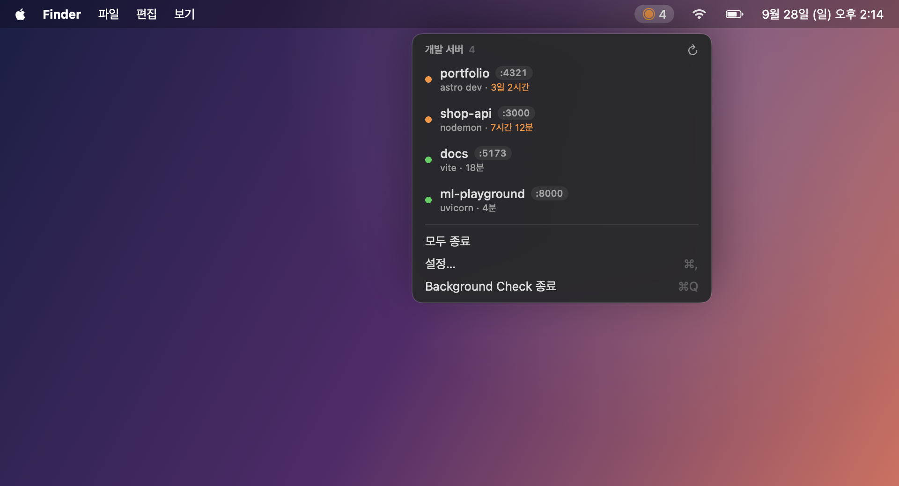
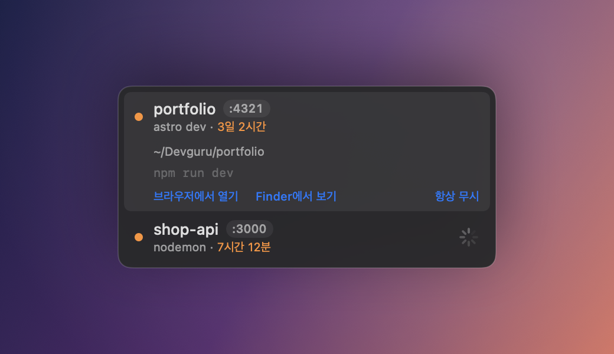
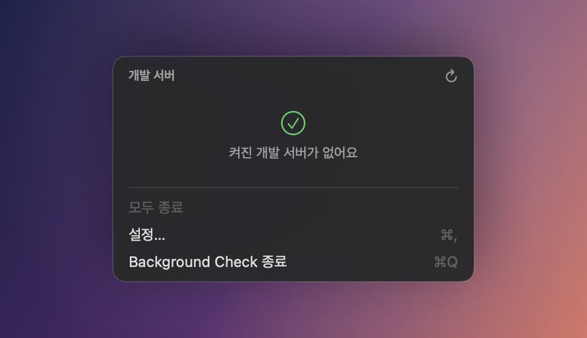
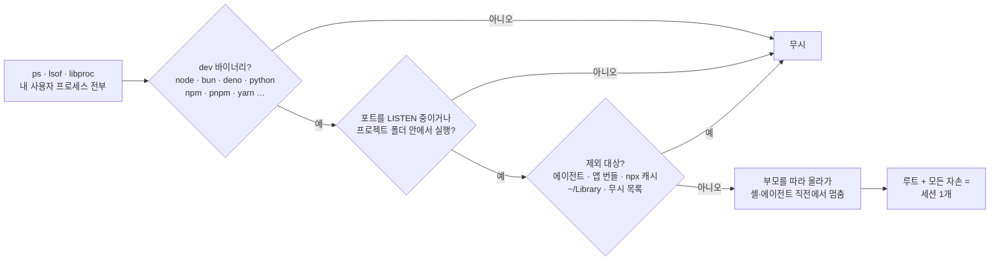
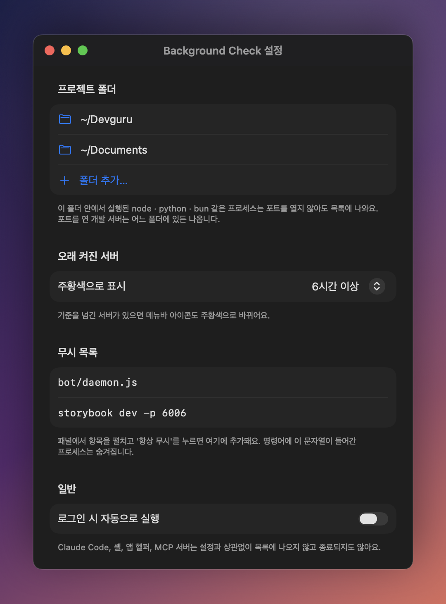

<h1 align="center">Background Check</h1>

<p align="center">
  <b>켜놓고 잊어버린 개발 서버, 메뉴바에서 한눈에 보고 한 번에 끕니다.</b><br>
  <sub>astro · vite · next · nodemon · uvicorn · http.server … 뭐든.</sub>
</p>

<p align="center">
  
  
  
  
</p>

<p align="center">
  
</p>

---

`npm run dev` 한 번, Claude Code 백그라운드 작업 한 번, 터미널 탭 닫기 한 번.
그렇게 3일째 `:4321`을 붙잡고 있는 astro 서버를 발견한 적이 있다면, 이 앱이 필요합니다.

Background Check는 메뉴바에 **지금 켜진 개발 서버 개수**를 띄워 둡니다.
오래 켜진 서버가 있으면 아이콘이 주황색으로 바뀌고, 클릭하면 어떤 프로젝트에서 무엇이 몇 번 포트로 얼마나 떠 있는지 보여줍니다.
<kbd>ⓧ</kbd> 한 번이면 `npm → node → esbuild`로 이어진 프로세스 트리가 통째로 정리됩니다.

## 주요 기능

- **메뉴바 배지** — 켜진 서버 개수를 항상 표시하고, 기준 시간(기본 6시간)을 넘긴 서버가 있으면 주황색으로 알려줍니다.
- **세션 단위 묶기** — `npm run dev`가 만든 npm · sh · node · esbuild를 한 줄로 묶어 보여주고, 한 번에 종료합니다.
- **알아서 이름 붙이기** — `package.json` / `pyproject.toml` / `.git` 위치로 프로젝트 이름을, 명령어로 `astro dev` · `vite` · `django runserver` 같은 도구 이름을 찾아냅니다.
- **안전한 종료** — 종료 직전에 한 번 더 스캔해서 같은 프로세스인지 확인한 뒤 SIGTERM을 보내고, 3초 뒤에도 살아 있으면 SIGKILL을 보냅니다.
- **건드리면 안 되는 건 절대 안 건드림** — Claude Code, 셸, 에디터, 앱 헬퍼, MCP 서버는 목록에 나오지도 않습니다. ([자세히](#절대-건드리지-않는-것))
- **가볍습니다** — 외부 의존성 0개. 패널이 닫혀 있을 땐 15초, 열려 있을 땐 3초마다 `ps` · `lsof` · `libproc`으로 훑어봅니다.

<table>
  <tr>
    <td width="50%"></td>
    <td width="50%"></td>
  </tr>
  <tr>
    <td align="center"><sub>행을 누르면 경로 · 명령어 · 바로가기가 펼쳐지고, 종료 중엔 스피너가 돕니다</sub></td>
    <td align="center"><sub>다 정리하면 이렇게 됩니다</sub></td>
  </tr>
</table>

## 설치

요구 사항: **macOS 14 Sonoma 이상**, **Xcode 16 이상** (또는 Swift 6 툴체인)

```bash
git clone https://github.com/Devguru-J/background-check.git
cd background-check
scripts/install.sh
```

`install.sh`는 release 빌드 → `.app` 번들 조립 → ad-hoc 서명 → `~/Applications`에 설치 → 실행까지 한 번에 합니다.
Dock 아이콘 없이 메뉴바에만 나타납니다. 업데이트할 때도 `git pull && scripts/install.sh` 한 줄이면 됩니다.

> 로그인할 때 자동으로 켜지게 하려면 **설정… → 로그인 시 자동으로 실행**을 켜세요.

## 사용법

| 하고 싶은 것 | 방법 |
|---|---|
| 뭐가 켜져 있나 보기 | 메뉴바 아이콘 클릭 |
| 하나 끄기 | 행에 마우스를 올리고 <kbd>ⓧ</kbd> (확인 없이 바로 종료) |
| 전부 끄기 | **모두 종료** (한 번 확인) |
| 브라우저로 열기 · Finder에서 보기 | 행을 눌러 펼치기 |
| 일부러 켜둔 데몬 숨기기 | 행을 펼치고 **항상 무시** |
| 설정 | <kbd>⌘</kbd><kbd>,</kbd> |

## 어떻게 찾아내나



예를 들어 Claude Code가 백그라운드로 `npm run dev`를 돌리면 트리는 이렇게 생겼습니다.

```
claude ─ zsh ─ npm run dev ─ sh -c astro dev ─ node astro dev ─ esbuild
               └──────────────────── 세션 (여기만 종료) ────────────────┘
```

`claude`와 `zsh`는 경계라서 세션에 들어가지 않고, npm이 띄운 `sh -c`는 건너뛰어서 npm까지 한 세션으로 묶습니다.
부모가 죽어 고아가 된 astro(`ppid 1`)는 그 자체로 하나의 세션이 됩니다.

## 절대 건드리지 않는 것

잘못된 프로세스를 죽이는 게 이 앱이 저지를 수 있는 최악의 실수입니다. 그래서 아래는 **설정이나 무시 목록과 상관없이** 코드에 고정해 두었습니다.

| 대상 | 판별 방법 |
|---|---|
| Claude Code · Codex | 네이티브 설치(`~/.local/share/claude/versions/…`), npm 설치(`claude`, `node …/bin/claude`) 모두 |
| 셸 · 에디터 · git | dev 바이너리가 아니면 후보가 되지 않고, 세션 경계로 취급 |
| 앱 헬퍼 | `.app/Contents/` 안의 실행 파일 (Claude · VS Code · Discord helper, JetBrains java, 앱 내장 node) — Xcode · Python 프레임워크만 예외 |
| MCP 서버 | 에이전트가 셸 없이 직접 띄운 프로세스, `npx`/`npm exec` 캐시(`~/.npm/_npx`)에서 도는 프로세스 |
| 앱이 번들한 런타임 | `~/Library/…` 아래 실행 파일 (예: Raycast의 node) |
| 다른 사용자 · root | 현재 사용자 소유 프로세스만 봅니다 |

이 규칙들은 [테스트](Tests/BackgroundCheckCoreTests)로 고정되어 있습니다. 실제 머신의 `ps` 출력 형태를 그대로 옮긴 케이스들입니다.

## 설정

<p align="center">
  
</p>

- **프로젝트 폴더** — 이 안에서 실행된 프로세스는 포트가 없어도(`tsc --watch`, 스크립트 등) 목록에 나옵니다. 기본값은 `~/Devguru`입니다.
- **오래 켜진 서버** — 주황색으로 표시할 기준 시간 (1 · 3 · 6 · 12 · 24 · 48시간)
- **무시 목록** — 명령어에 이 문자열이 들어간 프로세스는 숨깁니다. 세션 멤버 중 하나만 걸려도 세션 전체가 숨겨집니다.
- **로그인 시 자동으로 실행** — `~/Applications`에 설치된 앱에서만 동작합니다.

## 개발

```bash
swift build                    # 앱 + 코어 빌드
swift test                     # 테스트 45개 (실제 node 서버를 띄웠다 끄는 통합 테스트 포함)
.build/debug/BackgroundCheck   # 설치 없이 바로 실행
scripts/render-screenshots.sh  # README 이미지 다시 만들기
```

```
Sources/
├── BackgroundCheckCore/     UI 없는 순수 로직 — 전부 테스트됨
│   ├── SystemProbe.swift        ps · lsof · libproc 수집, SessionScanner
│   ├── DevProcessClassifier.swift  후보 / 제외 / 경계 판정
│   ├── SessionGrouper.swift     프로세스 트리 → 세션
│   ├── ProcessKiller.swift      SIGTERM → SIGKILL
│   └── …
└── BackgroundCheck/         SwiftUI 메뉴바 앱
    ├── AppModel.swift           스캔 루프, 종료, 설정 저장
    ├── MenuPanelView.swift      패널
    └── SettingsView.swift       설정 창
Tools/Screenshots/           README 이미지를 실제 뷰 + 예시 데이터로 렌더링
```

README 이미지는 화면 녹화가 아니라 **앱의 실제 SwiftUI 뷰에 예시 데이터를 넣어** 오프스크린 창에서 캡처한 것입니다. 개인 프로세스 정보가 섞이지 않고, UI를 고치면 스크립트 한 번으로 다시 만들 수 있습니다.

## 알려진 한계

- `npx serve`처럼 npx 캐시에서 바로 받아 띄운 서버는 MCP 서버와 구분이 안 돼서 숨겨집니다.
- iCloud Drive(`~/Library/Mobile Documents/…`) 안의 프로젝트는 목록에 나오지 않습니다.
- <kbd>ⓧ</kbd>를 누른 직후 목록은 다음 스캔(최대 3초)에 갱신됩니다.
- Docker 컨테이너, UDP 포트, 다른 사용자의 프로세스는 다루지 않습니다.
